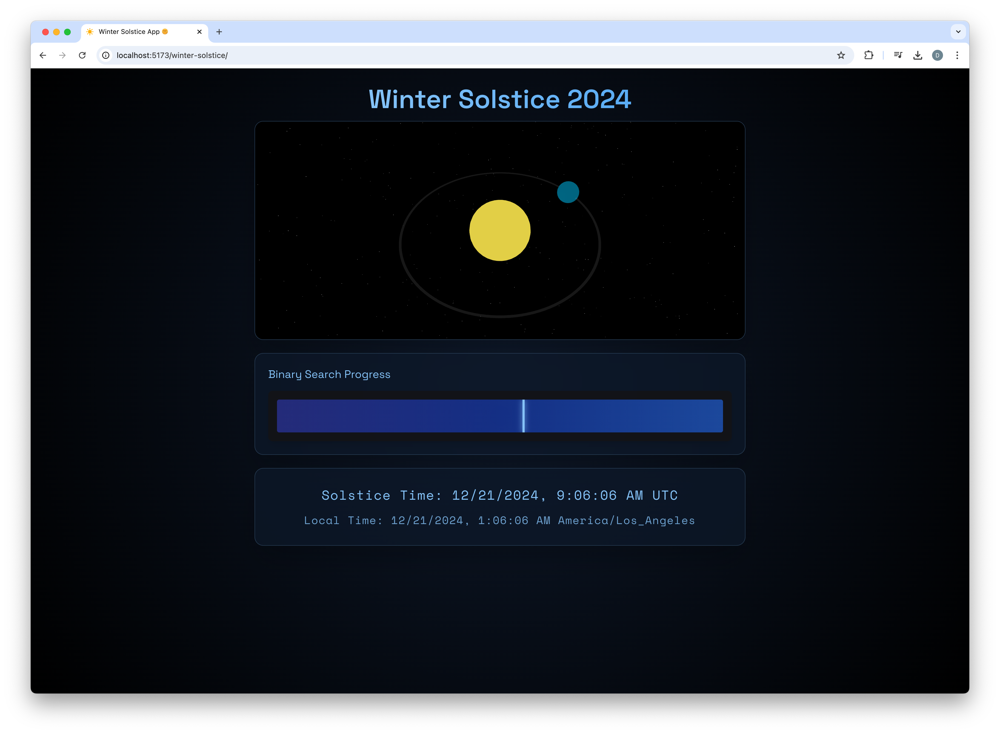

# Winter Solstice App 🌞 (Because We Totally Need Another Sun App)

Behold! Yet another web application that proves developers will literally visualize _anything_. This time, we're celebrating that magical moment when the Earth decides to tilt just right and give half the planet seasonal depression. Built with React and Three.js, because apparently regular 2D wasn't complicated enough.

## Screenshot (The Money Shot)


_Behold, the fruits of our procrastination_

## Features (Yes, We Actually Have Some)

- A fancy 3D visualization that will make your GPU question its life choices
- Super accurate astronomical calculations powered by Astronomia (because we're nerds like that)
- A UI so responsive it puts your ex's text replies to shame
- Animations smoother than your coffee shop pickup lines

## Tech Stack (The Cool Kids Club)

- React 18 (Because React 17 is _so_ last season)
- Vite (Because who has time to wait for webpack anymore?)
- Three.js (For when 2D just isn't pretentious enough)
- @react-three/fiber & @react-three/drei (More Three.js stuff, but make it React™)
- Tailwind CSS (Because writing actual CSS is too mainstream)
- Framer Motion (For those who think CSS transitions are too basic)
- Astronomia (Real astronomy calculations, not your horoscope app)

## Getting Started (Don't Worry, It's Only Rocket Science)

1. Clone the repository (you know, the usual ctrl+c, ctrl+v dance)
2. Install half the internet:
   ```bash
   npm install
   ```
3. Cross your fingers and run:
   ```bash
   npm run dev
   ```
4. Navigate to [http://localhost:5173](http://localhost:5173) and watch your computer fan go brrrr

## Scripts (Copy-Paste These Like We All Do)

- `npm run dev` - Start the development server (and your journey into madness)
- `npm run build` - Build for production (and pray it works)
- `npm run preview` - Preview the build (spoiler: it probably works)
- `npm run lint` - Pretend you care about code quality
